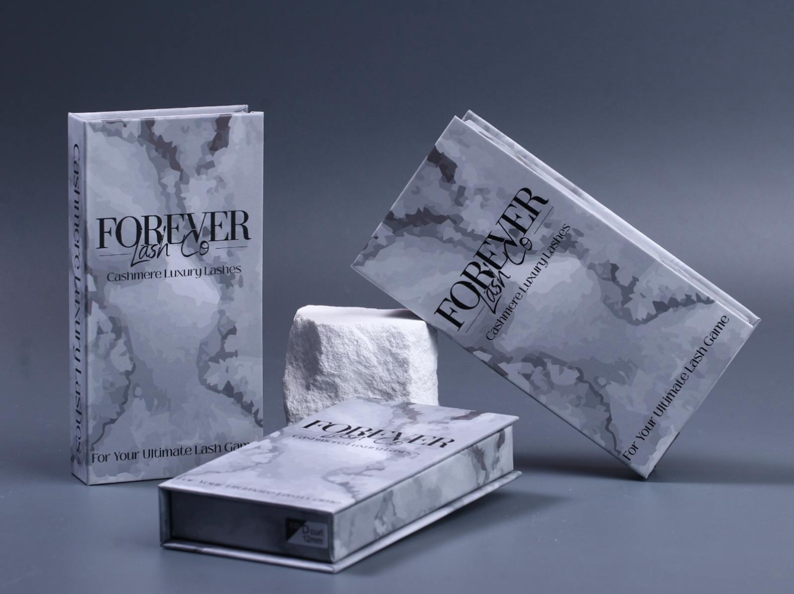
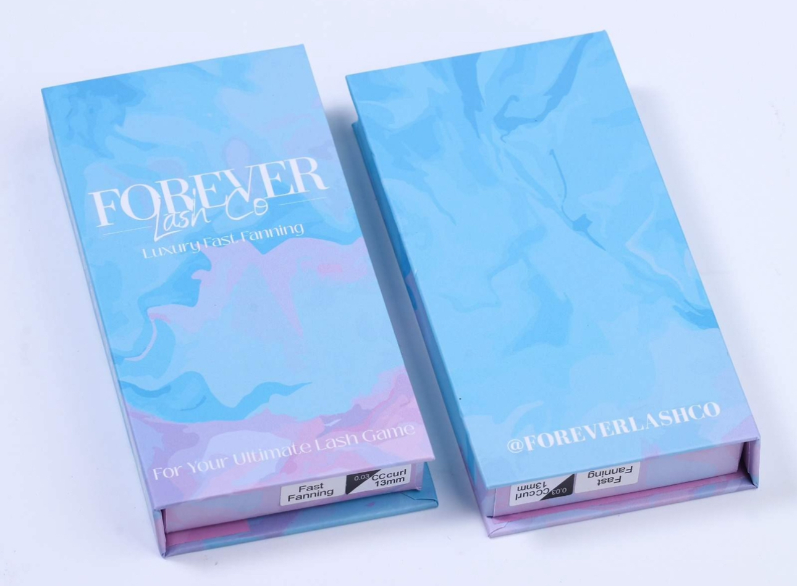
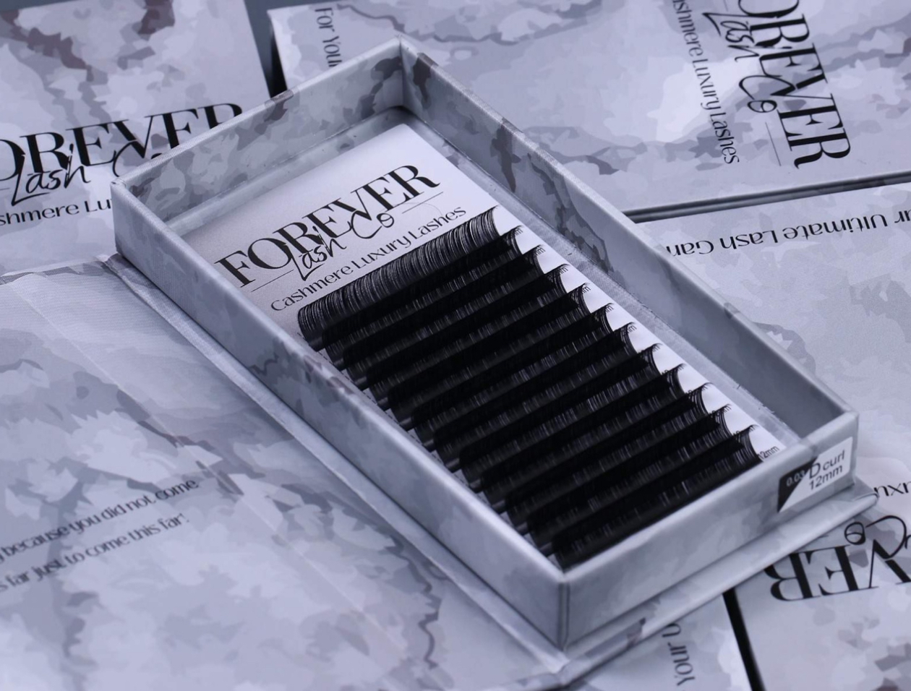
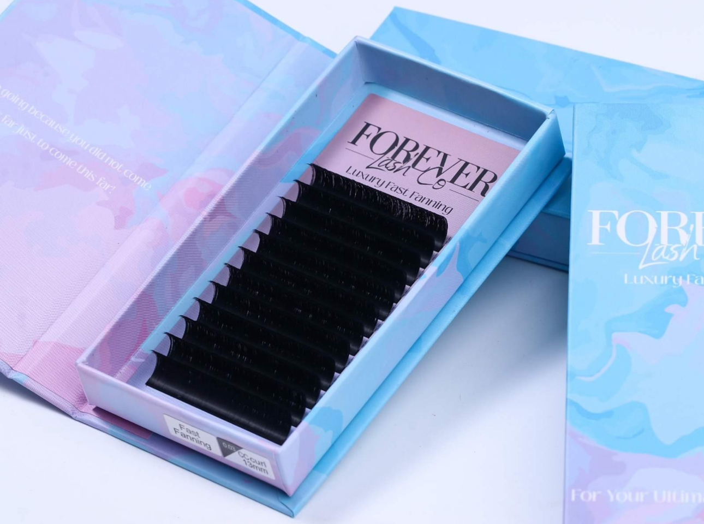
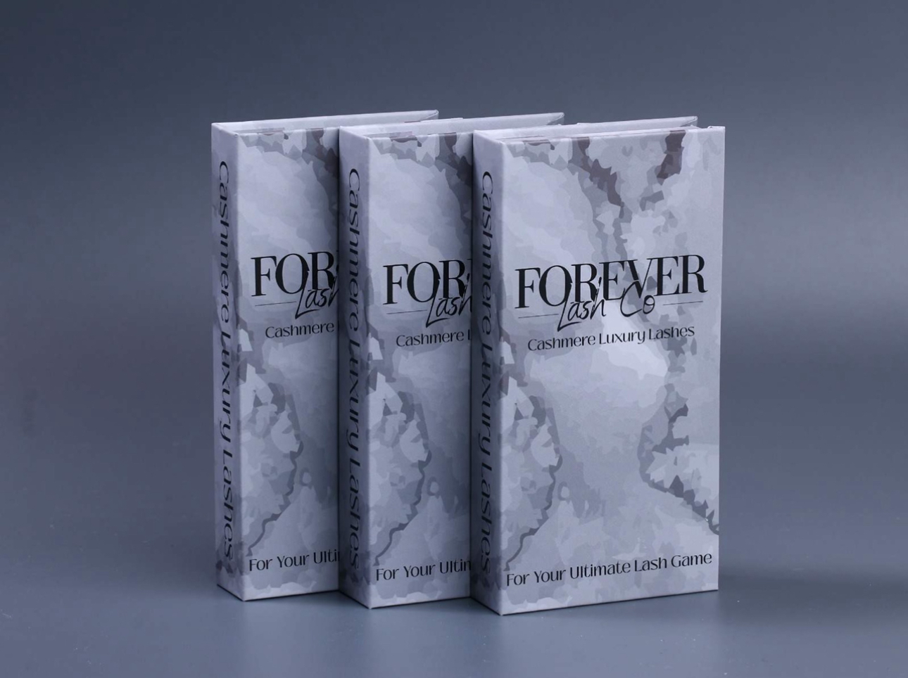
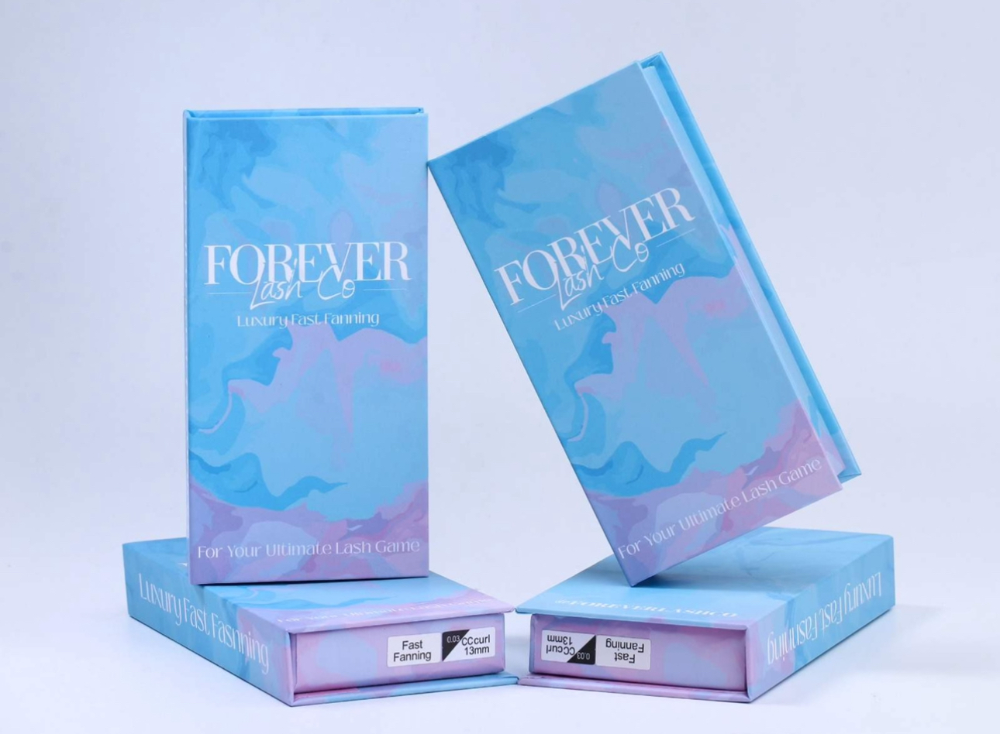

#Capstone-project1-E-Commerce-Website

Capstone 1 E-Commerce website. This project is an e-commerce website specifically designed for purchasing eyelash extensions.

## Table of Contents

- [About](#about)
- [Getting Started](#getting-started)
- [Built With](#built-with)
- [Features](#Features)

## About

Welcome to Forever Lash Co, a website that provides a selection of eyelash extension products. You can explore a vast selection of data and easily accessible navigation tools such as navbar, links and more. It provides a catalog of different eyelash extension products and allows users to browse, view items to their cart, and browse securely.

## Getting Started

- Frontend installation instructions through terminal: fork and clone the repo using the copy ssh link: git@github.com:LeslieAlvarado1/E-Commerce-Website-FLC.git . Navigate to the depository cloned and install dependecies (npm install).

  - In terminal cd into "my-react-app" to enter working directory. Once in correct location, insert in terminal "run npm dev" website which will pull into browser localhost.

- Frontend installation instructions through github/ visual studio code: under code dropdown menu, select open github desktop and clone to repository selected.
  - Once in correct location and in desktop, select open in visual studio code.
  - Once in VS Code, select open in browser.

## Built With

- HTML
- CSS
- JavaScript

## Features

- Inlcudes product catalog, shopping cart, registering, user authentication, etc.

## Usage

